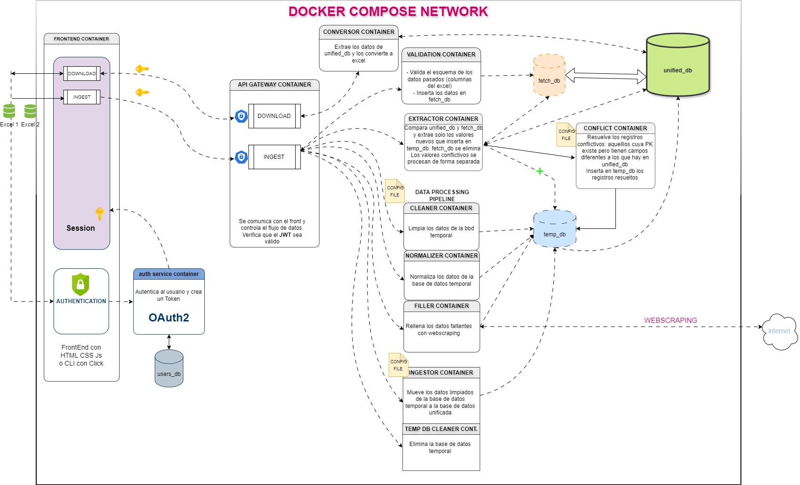

# XcelMerger
**Desafío** final de Bootcamp Data Science para **AIPOWER** : 
Limpiar y unificar documentos en una única base de datos
### v0.1.0


[](https://codecov.io/gh/sertemo/XcelMerger)


---

## Índice

1. [Antecedentes del proyecto](#1-antecedentes-del-proyecto)
2. [Participantes](#2-participantes)
3. [Descripción del reto](#3-descripción-del-reto)
   - [3.1- Objetivo del reto](#31--objetivo-del-reto)
   - [3.2- Criterios de evaluación](#32--criterios-de-evaluación)
4. [Estructura del proyecto](#4-estructura-del-proyecto)
   - [4.1- Arquitectura](#41--arquitectura)
   - [4.2- Estructura de carpetas y archivos](#42--estructura-de-carpetas-y-archivos)
   - [4.3- Bases de datos](#43--bases-de-datos)
     - [4.3.1- Bases de datos temporales](#431--bases-de-datos-temporales)
     - [4.3.2- Bases de datos permanentes](#432--bases-de-datos-permanentes)
5. [Metodología](#5-metodología)
6. [Unitesting](#6-unittesting)
   - [6.1- CI (Integración continua)](#61--ci-integración-continua)
7. [Despliegue](#7-despliegue)
   - [7.1- Servidor](#71--servidor)
     - [7.1.1- Datos técnicos](#711--datos-técnicos)
     - [7.1.2- Estructura de carpetas](#712--estructura-de-carpetas)
   - [7.2- CD (Despliegue continuo)](#72--cd-despliegue-continuo)
   - [7.3- https y certificado SSL](#73--https-y-certificado-ssl)
   - [7.4- URL](#74--url)
8. [Versiones](#8--versiones)
9. [Tecnologías](#9-tecnologías)
10. [Licencia](#10-licencia)

---

## 1- Antecedentes del proyecto
Tras finalizar el Bootcamp en Data Science de la Cámara de Comercio de Bilbao, ésta nos propuso participar en un desafío o reto (equivalente a un trabajo final de master) con la intención de poner en práctica todos los conocimientos adquiridos.

Carlos, Afonso y yo aceptamos el reto con la condición de realizarlo en equipo. La Cámara de comercio se encargaría de buscarnos un reto.

Tras varias semanas de espera, C2B se puso en contacto con nosotros describiendo las bases del reto que se describen a continuación.

## 2- Participantes
- [Carlos García](https://github.com/cagcruz) - carlosalberto8717@gmail.com
- [Afonso Teixeira](https://github.com/ATS-data) - afonsoteixeirasilva@gmail.com
- Sergio Tejedor - tejedor.moreno@gmail.com

## 3- Descripción del reto
El **11/07/2024** tuvimos la primera toma de contacto mediante videoconferencia con el que será el tutor de nuestro proyecto, [Miguel Ramos](miguel@thegoodriders.com) perteneciente a la empresa [AIPower](http://aipower.ai/).

### 3.1- Objetivo del reto
El objetivo de este reto es desarrollar una solución de data science que permita unificar,
normalizar, limpiar y completar nuestra base de datos de empresas y contactos. Esta
solución debe:
1. **Unificar los Datos**: Integrar todas las fuentes de datos en una única base de
datos centralizada.
2. **Normalización** de Campos: Estandarizar los campos para garantizar la
consistencia de la información.
3. Detección y **Corrección de Errores**: Identificar y corregir datos erróneos,
incluidos nombres de empresas, nombres de contactos, direcciones de correo
electrónico, etc.
4. Detección de **Duplicados**: Implementar mecanismos para detectar registros
duplicados, incluso cuando los nombres estén escritos de forma diferente,
utilizando técnicas avanzadas de deduplicación.
5. **Relleno de Datos Faltantes**: Completar datos obligatorios faltantes como CIF,
correos electrónicos, etc., mediante web scraping de fuentes confiables.

### 3.2- Criterios de evaluación
Exactitud y Precisión: Efectividad en la corrección y normalización de datos.
- **Eficiencia**: Tiempo y recursos utilizados para procesar los datos.
- **Escalabilidad**: Capacidad para manejar grandes volúmenes de datos y nuevas
fuentes de información.
- **Documentación y Reproducibilidad**: Calidad de la documentación y facilidad
para reproducir los resultados.


## 4- Estructura del proyecto
### 4.1- Arquitectura


### 4.2- Estructura de carpetas y archivos
```
XcelMerger/
│
├── common/  # Archivos accesibles por todos los servicios
│   ├── logging_config.py  # Configuración del logging
│   ├── settings.py  # Rutas, constantes y algunos parámetros
│   ├── .env  # Variables de entorno, secretos y urls de las bases de datos
│   └── databases/
│       ├── engines.py  # Definición de los conectores de las bases de datos
│       └── models.py  # Definición de todas las tables de las bases de datos
│
├── services/  # Aquí estarán todos los servicios. Cada uno es un proyecto independiente
│   ├── auth/
│   │   ├── Dockerfile
│   │   ├── src/  # Código fuente del servicio
│   │   │   ├── __init__.py
│   │   │   └── main.py
│   │   └── tests/
│   │       ├── __init__.py
│   │       └── test_auth.py
│   │
│   └─── frontend/
│        ├── Dockerfile
│        ├── src/
│        │   ├── __init__.py
│        │   └── app.py
│        └── tests/
│            ├── __init__.py
│            └── test_frontend.py 
│
├── docker-compose.yml
└── pyproject.toml
```
### 4.3- Bases de datos
El proyecto constará de **1 bases de datos permanente** y **3 bases de datos temporales**. 

Las bases de datos se inicializan al comenzar el servicio **auth** empleando para ello el **lifespan** de la app que ofrece FastAPI.

El código es el siguiente:

```py
@asynccontextmanager
async def lifespan(app: FastAPI):
    # Inicializamos todas las bases de datos al iniciar la aplicación
    init_databases()
    logger.info("Bases de datos inicializadas correctamente")
    try:
        # Agregamos un user admin por defecto a la db de usuarios
        with users_session.begin() as session:
            user = db_models.User(
                username="admin",
                hashed_password=os.getenv("ADMIN_PASS"),
                full_name="Usuario Admin para pruebas",
                email="tejedor.moreno.@gmail.com",
            )
            session.add(user)
            logger.info(f"User agregado correctamente: {user.username}")
        yield
    except Exception as e:
        logger.error(f"Error al inicializar las bases de datos: {e}")
        raise
```

#### 4.3.1- Bases de datos temporales
- **fetch_db** | **PostgresSQL**
En esta base de datos se vuelcan los datos tras la validación preliminar del esquema en el contenedor de validación. Posteriormente el servicio de extracción comparará los valores de fetch_db con los de **unified_db** y extraerá aquellos registros nuevos tras lo cual se eliminará fetch_db.

- **temp_db** | **PostgresSQL**
Una vez extraidos los registros únicos y resuelto ciertos conflictos con la base de datos unified_db, los datos a procesar se guardan en temp_db, que es la base de datos sobre la que trabajará el servicio de procesamiento de los datos.

- **users_db** | **SQLite**
Esta base de datos tiene los registros de los usuarios con acceso a la aplicación. Se crea al iniciarse el servicio auth (ver código más arriba) y se añade un usuario admin. La base de datos se elimina al eliminarse los contendores.

#### 4.3.2- Bases de datos permanentes
- **unified_db** | **PostgresSQL**
Esta es la base de datos definitiva con todos los registros limpiados, unificados y normalizados

## 5- Metodología

## 6- Unitesting
### 6.1- CI (Integración continua)
Para la integración continua y el testing se usan las siguientes tecnologías:
- **black** como formateador automático para legibilidad y consistencia
- **flake8** como herramienta de linting para la corrección de problemas de estilo en el código
- **mypy** como herramienta de verificación de tipos
- **pytest** como herramienta de testing para la ejecución de pruebas

Estas tecnologías se utilizan para comprobar el código durante el desarrollo (`check.sh`) y durante los push al respositorio mediante el siguiente workflow de Github Actions.

Las pruebas se ejecutan para la versión de Python 3.11 y en los sistemas operativos de **Linux ubuntu** y **Windows**.

```yaml
name: Tests

on:
  push:
    branches:
      - main
      - develop
    paths:
      - 'services/**'
      - 'common/**'
  pull_request:

jobs:
  setup:
    runs-on: ubuntu-latest
    strategy:
      matrix:
        os: [ubuntu-latest, windows-latest]
        python-version: ['3.11']
    steps:
      - uses: actions/checkout@v4
      - uses: actions/setup-python@v5
        with:
          python-version: ${{ matrix.python-version }}
      - name: Cache poetry
        uses: actions/cache@v4
        with:
          path: |
            ~/.cache/pypoetry
            ~/.virtualenvs
          key: ${{ runner.os }}-poetry-${{ hashFiles('**/poetry.lock') }}
      - name: Install dependencies
        run: |
          python -m pip install --upgrade pip
          pip install poetry
          poetry install --no-root --only dev

  black:
    runs-on: ${{ matrix.os }}
    strategy:
      matrix:
        os: [ubuntu-latest, windows-latest]
        python-version: ['3.11']
    steps:
      - uses: actions/checkout@v4
      - uses: actions/setup-python@v5
        with:
          python-version: ${{ matrix.python-version }}
      - name: Cache poetry
        uses: actions/cache@v4
        with:
          path: |
            ~/.cache/pypoetry
            ~/.virtualenvs
          key: ${{ runner.os }}-poetry-${{ hashFiles('**/poetry.lock') }}
      - name: Install dependencies
        run: |
          python -m pip install --upgrade pip
          pip install poetry
          poetry install --no-root --only dev
      - name: Run Black
        run: poetry run black --check services

  mypy:
    runs-on: ${{ matrix.os }}
    strategy:
      matrix:
        os: [ubuntu-latest, windows-latest]
        python-version: ['3.11']
    steps:
      - uses: actions/checkout@v4
      - uses: actions/setup-python@v5
        with:
          python-version: ${{ matrix.python-version }}
      - name: Cache poetry
        uses: actions/cache@v4
        with:
          path: |
            ~/.cache/pypoetry
            ~/.virtualenvs
          key: ${{ runner.os }}-poetry-${{ hashFiles('**/poetry.lock') }}
      - name: Install dependencies
        run: |
          python -m pip install --upgrade pip
          pip install poetry
          poetry install --no-root --only dev
      - name: Run MyPy
        run: poetry run mypy services --install-types --non-interactive

  flake8:
    runs-on: ${{ matrix.os }}
    strategy:
      matrix:
        os: [ubuntu-latest, windows-latest]
        python-version: ['3.11']
    steps:
      - uses: actions/checkout@v4
      - uses: actions/setup-python@v5
        with:
          python-version: ${{ matrix.python-version }}
      - name: Cache poetry
        uses: actions/cache@v4
        with:
          path: |
            ~/.cache/pypoetry
            ~/.virtualenvs
          key: ${{ runner.os }}-poetry-${{ hashFiles('**/poetry.lock') }}
      - name: Install dependencies
        run: |
          python -m pip install --upgrade pip
          pip install poetry
          poetry install --no-root --only dev
      - name: Run Flake8
        run: poetry run flake8 services

  pytest:
    runs-on: ${{ matrix.os }}
    strategy:
      matrix:
        os: [ubuntu-latest, windows-latest]
        python-version: ['3.11']
    steps:
      - uses: actions/checkout@v4
      - uses: actions/setup-python@v5
        with:
          python-version: ${{ matrix.python-version }}

      - name: Cache poetry
        uses: actions/cache@v4
        with:
          path: |
            ~/.cache/pypoetry
            ~/.virtualenvs
          key: ${{ runner.os }}-poetry-${{ hashFiles('**/poetry.lock') }}

      - name: Install dependencies
        env:
          PYTHONPATH: ${{ github.workspace }}
        run: |
          python -m pip install --upgrade pip
          pip install poetry
          poetry install --no-root

      - name: Create logs directory  # Para que no me de error el logger
        run: mkdir -p logs

      - name: Run Pytest
        env:  # Variables de entorno de los .env
          SECRET_KEY: ${{ secrets.ENV_SECRET_KEY }}
          ALGORITHM: ${{ secrets.ENV_ALGORITHM }}
          USER_DB_URL: ${{ secrets.ENV_USER_DB_URL }}
        run: poetry run pytest

      - name: Upload coverage reports to Codecov
        uses: codecov/codecov-action@v4.0.1
        with:
          token: ${{ secrets.CODECOV_TOKEN }}
```


## 7- Despliegue
### 7.1- Servidor
#### 7.1.1- Datos técnicos
Para las pruebas de despliegue, se desplegará el proyecto en mi servidor casero. Se trata de un mini ordenador Beelink con las siguientes características:
```sh
Architecture:             x86_64
  CPU op-mode(s):         32-bit, 64-bit
  Address sizes:          39 bits physical, 48 bits virtual
  Byte Order:             Little Endian
CPU(s):                   4
  On-line CPU(s) list:    0-3
Vendor ID:                GenuineIntel
  Model name:             Intel(R) N100
    CPU family:           6
    Model:                190
    Thread(s) per core:   1
    Core(s) per socket:   4
    Socket(s):            1
    Stepping:             0
    CPU(s) scaling MHz:   84%
    CPU max MHz:          3400,0000
    CPU min MHz:          700,0000
```

#### 7.1.2- Estructura de carpetas
Dentro del servidor la estructura de carpetas será la siguiente:

```
XcelMerger/
│
├── common/  # Archivos accesibles por todos los servicios
│   ├── logging_config.py  # Configuración del logging
│   ├── settings.py  # Rutas, constantes y algunos parámetros
│   ├── .env  # Variables de entorno, secretos y urls de las bases de datos
│   └── databases/
│       ├── engines.py  # Definición de los conectores de las bases de datos
│       └── models.py  # Definición de todas las tables de las bases de datos
│
├── docker-compose.yml
```

La carpeta common y todos sus archivos se copian en el workflow **deploy** de Github Actions al hacer un push a la rama **main**.

Ver apartado de despliegue continuo.

El archivo `docker-compose.yml` del servidor difiere ligeramente del archivo que tenemos en local para el desarrollo del proyecto ya que el docker-compose del servidor descarga las imágenes de cada servicio alojadas en el **DockerHub**, no las construye.

`docker-compose.yml`
```yml
services:
  auth:
    image: sertemo/xcelmerger:auth
    env_file:
      - ./common/.env
    ports:
      - "8000:8000"
    volumes:
      - ./logs:/app/logs
      - ./common:/app/common
    container_name: auth_container
    networks:
      - xm_network
    restart: unless-stopped

  frontend:
    image: sertemo/xcelmerger:frontend
    env_file:
      - ./common/.env
    ports:
      - "5050:5050"
    volumes:
      - ./logs:/app/logs
      - ./common:/app/common
    container_name: frontend_container
    networks:
      - xm_network
    restart: unless-stopped

  postgres_fetch_db:
    image: postgres:latest
    container_name: fetch_db_container
    environment:
      POSTGRES_USER: ${FETCH_DB_USER}
      POSTGRES_PASSWORD: ${FETCH_DB_PASSWORD}
      POSTGRES_DB: ${FETCH_DB_NAME}
    ports:
      - "5432:5432"
    env_file: ./common/.env
    volumes:
      - fetch_db_data:/var/lib/postgresql/data
    networks:
      - xm_network
    restart: unless-stopped

networks:
  xm_network:
    driver: bridge

```

### 7.2- CD (Despliegue continuo)
Se configura un workflow para levantar la red automáticamente en el servidor con cada `push` a la rama `main`.

Los trabajos realizados son:
- login en mi **DockerHub**
- Creación de las imágenes de cada servicio y push al Hub
- Copia de los archivos comunes a la carpeta del proyecto dentro del servidor mediante **SCP**.
- Creación del archivo `.env` utilizando los secretros de Github Actions dentro de /common.
- Construcción de los contenedores e inicialización de la red con docker-compose dentro del servidor mediante **SSH**.
- Limpieza de imágenes antiguas.

El paso de la creación del archivo `.env` es necesario ya que este archivo no se transfiere a Github y por lo tanto no se copia en la carpeta common. Sin embargo este archivo es fundamental para el funcionamiento de la aplicación.

El archivo que realiza dichas tareas es el siguiente:

`deploy.yml`
```yml
name: CD Pipeline

on:
  push:
    branches:
      - main

jobs:
  build-and-deploy:
    runs-on: ubuntu-latest

    steps:
    - name: Checkout code
      uses: actions/checkout@v4

    - name: Set up QEMU
      uses: docker/setup-qemu-action@v3

    - name: Set up Docker Buildx
      uses: docker/setup-buildx-action@v3

    - name: Login to DockerHub 
      uses: docker/login-action@v3
      with:
        username: ${{ secrets.DOCKERHUB_USERNAME }}
        password: ${{ secrets.DOCKERHUB_PASSWORD }}

    - name: Build and push auth image
      uses: docker/build-push-action@v5
      with:
        context: ./services/auth
        push: true
        tags: ${{ secrets.DOCKERHUB_USERNAME }}/xcelmerger:auth

    - name: Build and push frontend image
      uses: docker/build-push-action@v5
      with:
        context: ./services/frontend
        push: true
        tags: ${{ secrets.DOCKERHUB_USERNAME }}/xcelmerger:frontend

    - name: Copy common folder to server
      uses: appleboy/scp-action@v0.1.7
      with:
        host: ${{ secrets.SERVER_SSH_HOST }}
        username: ${{ secrets.SERVER_SSH_USER }}
        password: ${{ secrets.SERVER_SSH_KEY }}
        port: ${{ secrets.SERVER_SSH_PORT }}
        source: "common/*"
        target: "${{ secrets.SERVER_PROJECT_PATH }}"
        debug: true

    - name: Create common .env file on server  # TODO Agregar todos los datos de entorno
      uses: appleboy/ssh-action@v1.0.3
      with:
        host: ${{ secrets.SERVER_SSH_HOST }}
        username: ${{ secrets.SERVER_SSH_USER }}
        password: ${{ secrets.SERVER_SSH_KEY }}
        port: ${{ secrets.SERVER_SSH_PORT }}
        script: |
          echo "USER_DB_URL=${{ secrets.USER_DB_URL }}" > ${{ secrets.SERVER_PROJECT_PATH }}/common/.env
          # TODO Agregar todas las variables de entorno

    - name: Deploy to server
      uses: appleboy/ssh-action@v1.0.3
      with:
        host: ${{ secrets.SERVER_SSH_HOST }}
        username: ${{ secrets.SERVER_SSH_USER }}
        password: ${{ secrets.SERVER_SSH_KEY }}
        port: ${{ secrets.SERVER_SSH_PORT }}
        script: |
          source ~/.bashrc  # Para que las rutas estén en el path
          cd ${{ secrets.SERVER_PROJECT_PATH }}
          /usr/libexec/docker/cli-plugins/docker-compose pull
          /usr/libexec/docker/cli-plugins/docker-compose up -d

    - name: Cleanup old images
      uses: appleboy/ssh-action@v1.0.3
      with:
        host: ${{ secrets.SERVER_SSH_HOST }}
        username: ${{ secrets.SERVER_SSH_USER }}
        password: ${{ secrets.SERVER_SSH_KEY }}
        port: ${{ secrets.SERVER_SSH_PORT }}
        script: |
          docker image prune -f
```


### 7.3- https y certificado SSL
Se describirán los pasos realizados para obtener un certificado SSL renovable automáticamente de cara a utilizar el protocolo https.

Se deberán añadir 2 contenedores extras:
- **Certbot**: Emite y actualiza periódicamente (cada 12 horas) los certificados **SSL**.
- **nginx**: Actúa como proxy inverso manejando las solicitudes HTTP y HTTPS y redirigiéndolas al servidor Gunicorn que ejecuta la aplicación en Flask (el frontend).

### 7.4- URL
La URL para las pruebas es [esta](http://trymlmodels.com:5050).

## 8- Versiones
- 0.1.0: versión inicial del proyecto

## 9- Tecnologías


## 10- Licencia
Copyright 2024 Carlos García, Afonso Teixeira, Sergio Tejedor

Licensed under the Apache License, Version 2.0 (the "License");
you may not use this file except in compliance with the License.
You may obtain a copy of the License at

    http://www.apache.org/licenses/LICENSE-2.0

Unless required by applicable law or agreed to in writing, software
distributed under the License is distributed on an "AS IS" BASIS,
WITHOUT WARRANTIES OR CONDITIONS OF ANY KIND, either express or implied.
See the License for the specific language governing permissions and
limitations under the License.

